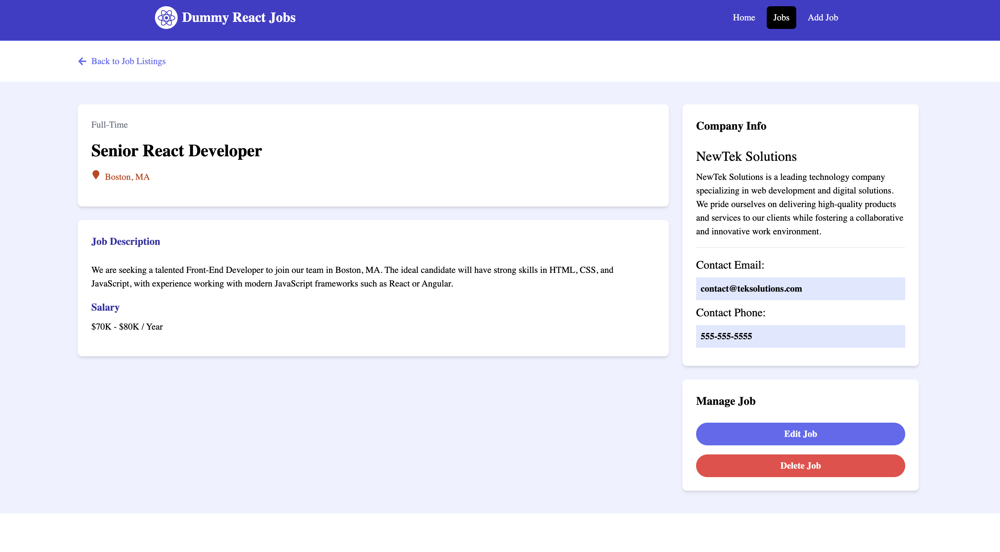

# React + Vite

A simple job portal with CRUD functionality built using react.js. I built it for learning purpose and to freshen up my knowlege. Back in 2018, while working as a Data Engineer I used to build custom QC dashboards for data validation, using flask, jinja and stuff like redis and Celery. Since then I never created any app with frontend. So now as I have grown older I want to bring some colors in my life :)

Concepts used in this app are: Components, State Management, Data Loaders, Proxy, multiple Hooks from React Router, Mocked Json Server for backend.

Install
```
npm i
```

Run the App
```
npm run dev
```

Run the Backend Server
```
npm run server
```

## Some Screen Shots


<br/>


<br/>


<br/>


<br/>
